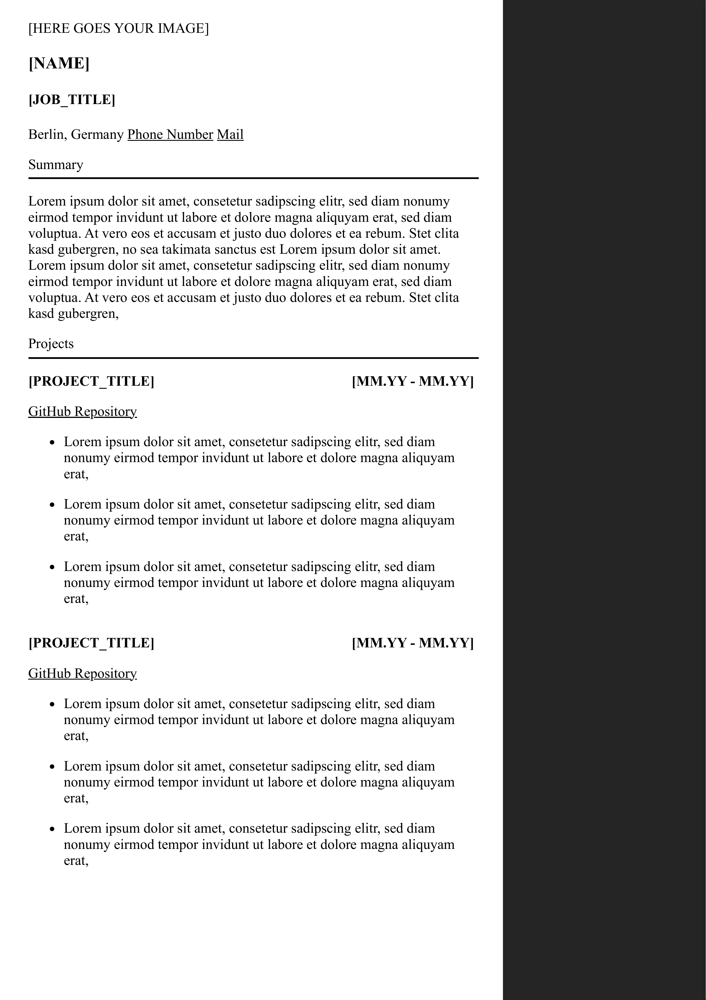
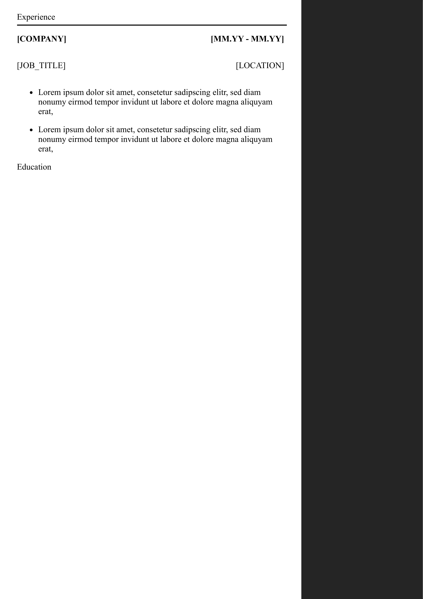

# CV-Template(WIP)

A modern CV Template with a sidebar to show your profiles, technical skills, softskills & languages.

This is a subproject for the [ApplicationManager](https://github.com/justusdecker/Application-Manager)

The CV Template contains:
* [x] The Summary
* [x] Projects
* [x] Experience
* [x] Education
* [x] A place for your picture(`512x512px`)
* [x] The Sidebar
    * [x] Profiles
    * [x] Technical Skills
    * [x] Softskills
    * [x] Languages
* [x] A duck
* [x] Replaced placeholders by jinja placeholders
* [ ] A python script that will convert the `index.html` based on the given `cvc class` to the finished html.

## Preview(Not finished yet)

