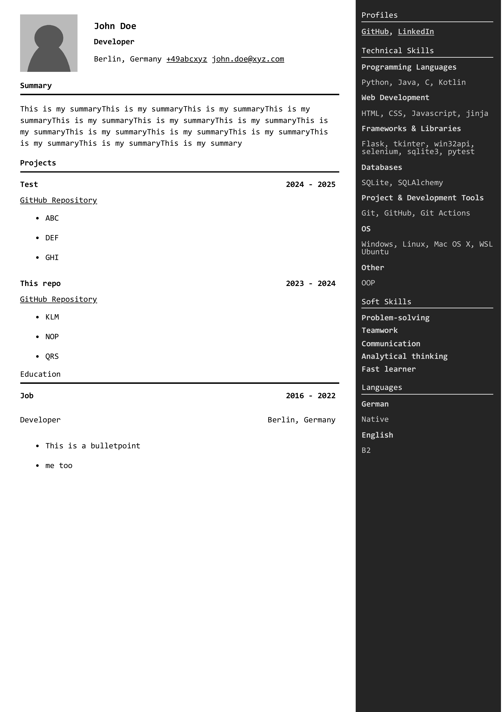
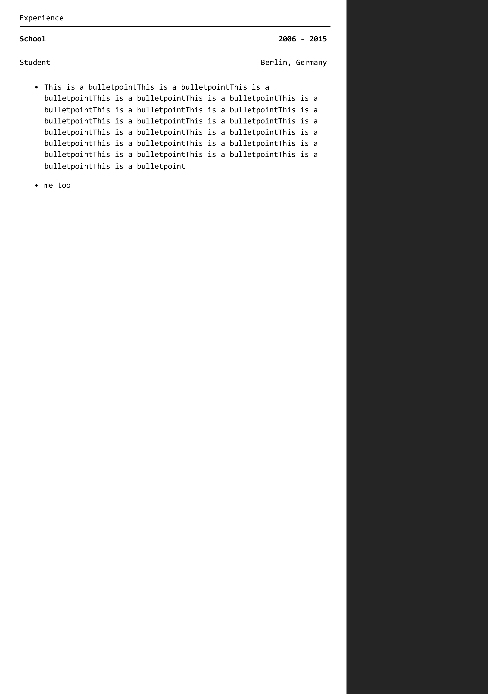

# CV-Template(WIP)

A modern CV Template with a sidebar to show your profiles, technical skills, softskills & languages that can be automated(The tools for that are also included [look here](#the-cv-template-contains)).

This is a subproject for the [ApplicationManager](https://github.com/justusdecker/Application-Manager)

## Preview



## The CV Template contains:
* [x] The Summary
* [x] Projects
* [x] Experience
* [x] Education
* [x] A place for your picture(`512x512px`)
* [x] The Sidebar
    * [x] Profiles
    * [x] Technical Skills
    * [x] Softskills
    * [x] Languages
* [x] A duck
* [x] Replaced placeholders by jinja placeholders
* [x] A python script that will convert the `index.html` based on the given `cvc class` to the finished html.

## How to use

### The demo method:
1. Update the data in the `./src/cvc_settings.py`
2. run `./cv_generator.py`
3. open the `test.html`

### The production method

1. Create you own template of `CVC`
2. import this into `cv_generator.py` & remove the default 'CVC'
3. Update your `512x512px` profile picture located in `./src/img/profile.png`. 
4. Expand the code to your needs

Example:
***
```python
imports...

def generate(filepath: str, settings: CVC = CVC): ...

CVCS = [CVC1, CVC2, CVC3]
PATHS = ['one','two', 'three']
for cvc, path in zip(CVCS, PATHS):
    generate(path + '.html', cvc)
```